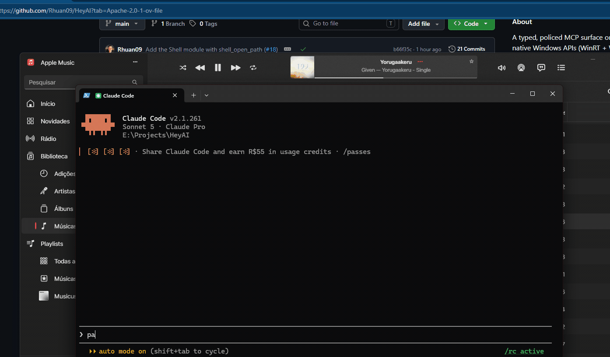
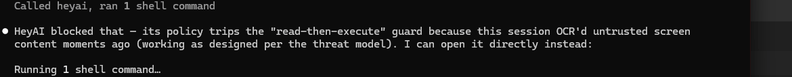

# HeyAI

**A typed, policed MCP surface onto native Windows APIs — with a permission model, not
just a PowerShell hole.**

HeyAI is an MCP server. Point Claude Code, Cursor, or any MCP client at it and the agent
can read what is playing, control media, manage windows, and read the screen through
native WinRT — with a deny-by-default allowlist, per-invocation risk classification, and
an append-only audit log it cannot reach.

It is not an assistant. Your assistant is whatever you already use. HeyAI is the layer
underneath it, so you can build your own Jarvis without reimplementing Windows.



Three things happen there. It **pauses the music** through the system's own media controls.
It **asks before opening a folder** — `shell_open_path` is `Critical`, so it stops at a
dialog where Deny is the default and Allow stays disabled for a moment, and nothing runs
until a person clicks. Then it **reads the screen** with `Windows.Media.Ocr`: offline,
already installed, a full 1080p screen in well under a second.

## Status

All five modules working end to end against a real desktop, with MSIX packaging and a
tray that answers confirmation prompts. See [the roadmap](docs/ARCHITECTURE.md#roadmap).

`Critical` actions — currently only `shell_open_path` in open mode — are never approved
automatically. They stop at a dialog, and if the tray is not running they are refused.

## Install

There is no packaged release yet (see [Distribution](docs/ARCHITECTURE.md#distribution)).
Build from source:

```bash
git clone https://github.com/Rhuan09/HeyAI
cd HeyAI
dotnet build -c Release
```

Then point your MCP client at the built executable:

```bash
claude mcp add heyai -- <repo>/src/HeyAI.Server/bin/Release/net10.0-windows10.0.26100.0/heyai.exe
```

## Tools

| Tool | Risk | Default | What it does |
| --- | --- | --- | --- |
| `media_get_status` | read | on | Active media sessions with track, artist, play state |
| `media_control` | convenience | on | play / pause / toggle / next / previous / stop |
| `audio_get_devices` | read | on | Output devices and the per-app mixer |
| `audio_set_volume` | convenience | on | Master or per-application volume and mute |
| `window_list_open` | read | on | Open windows with process, focus and minimized state |
| `window_focus` | convenience | off | Bring a window to the foreground |
| `window_set_state` | convenience | off | Minimize, maximize or restore a window |
| `ocr_read_text` | read | off | Read the text on screen, or in one window |
| `screen_capture` | read | off | Return the screen, or one window, as an image |
| `shell_open_path` | **critical** | off | Open a file or folder, or reveal it in Explorer |

Anything that reads the screen or starts a program ships **disabled**:

```bash
heyai enable ocr_read_text
```

## Try it without an agent

```bash
heyai.exe doctor              # check the STA dispatcher and state directory
heyai.exe list                # registered tools and whether they are enabled
heyai.exe test media_get_status
heyai.exe test audio_set_volume '{"target":"app","app":"firefox","level":0.3}'
heyai.exe test window_list_open
heyai.exe test ocr_read_text
```

`heyai.exe test` runs the full policy and audit pipeline, so what you see is what an agent
would get.

## Security

HeyAI gives a language model tools that read attacker-chosen content *and* tools that act
on your machine. That combination is the whole risk, and it is designed against rather
than hand-waved: untrusted output is marked and fenced, `Critical` actions are refused for
a window after any untrusted read, and everything — including refusals — is audited.

Here is that design refusing a request, unprompted, during the recording of the demo
above — the agent had just read the screen, so the `Critical` action that followed was not
even offered for confirmation:



Note the second half of that sentence. The agent then opened the folder with its own
shell, and it was right to say so: **HeyAI governs HeyAI's tools, not everything its
client can do.** It is a permission layer, not a sandbox around the agent. If your threat
model needs the latter, this is not it.

Read [docs/SECURITY.md](docs/SECURITY.md) before enabling anything beyond the defaults. It
also states what HeyAI does *not* protect against.

## Contributing

Read [docs/NON-GOALS.md](docs/NON-GOALS.md) before proposing a tool — several categories
are closed by design, and the reasoning there answers most proposals faster than a thread
will.

Then [CONTRIBUTING.md](CONTRIBUTING.md) for the branching model, the PR checklist, and
the rules that are not negotiable. [docs/ARCHITECTURE.md](docs/ARCHITECTURE.md) explains
why things are shaped the way they are.

```bash
dotnet build
dotnet test --filter "Category!=RequiresDesktop"    # what CI runs
dotnet test --filter "Category=RequiresDesktop"     # run locally before every PR
```

CI cannot test WinRT interop — `windows-latest` has no audio endpoint and no media
session — so desktop-gated tests are on you before opening a PR.

## Licence

[Apache-2.0](LICENSE).
